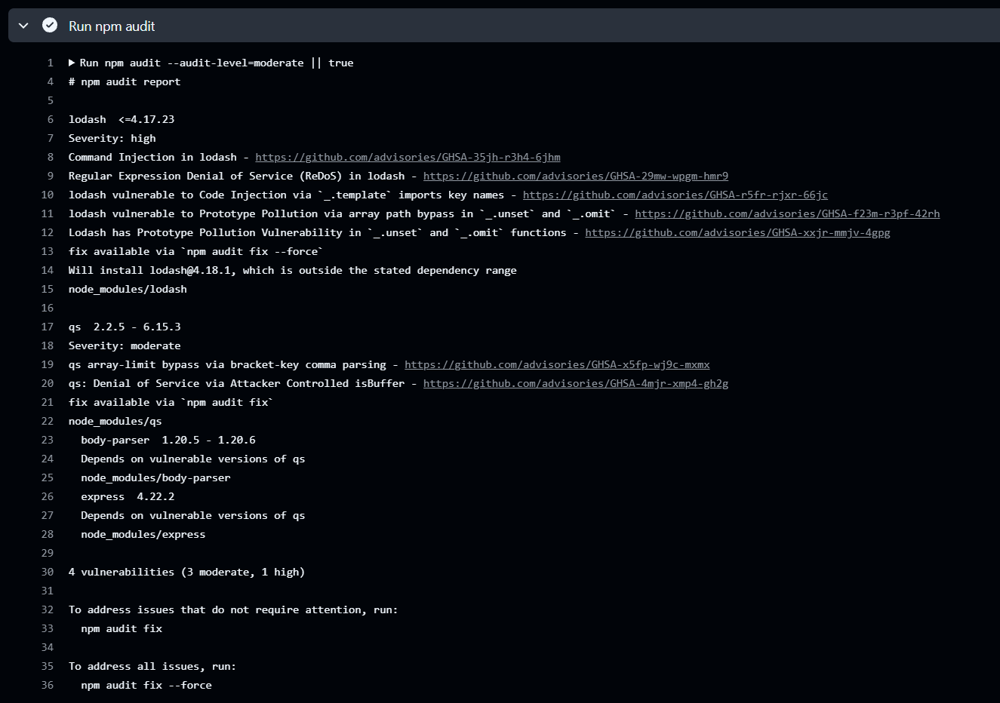
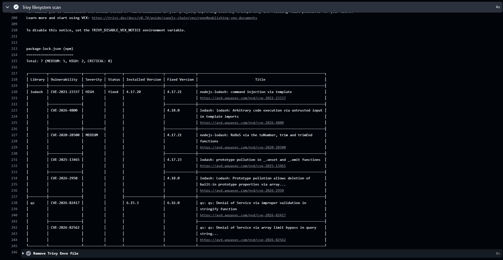
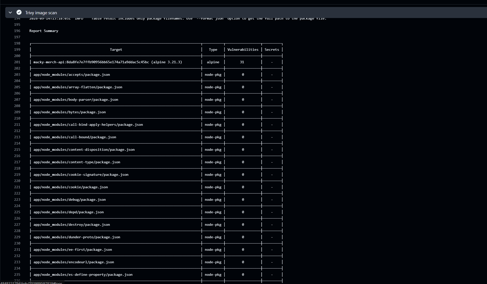
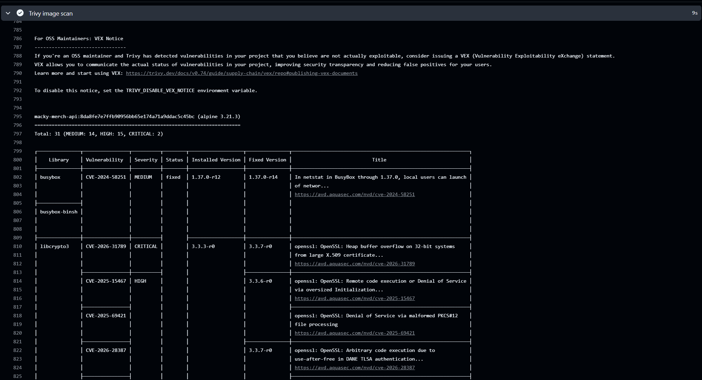

# Macky Merch API — DevSecOps Starter

**LSCS DevSecOps Engineering Take-Home Exam**

A containerized Express.js API with a fully automated CI/CD pipeline that integrates security scanning at every stage — from dependency audits to Docker image vulnerability analysis.

---

## Table of Contents

- [Project Overview](#-project-overview)
- [Setup Instructions](#-setup-instructions)
- [Architectural Explanation](#-architectural-explanation)
- [CI/CD Pipeline](#-cicd-pipeline)
- [Vulnerability Demonstration](#-vulnerability-demonstration)
- [Challenges Faced](#-challenges-faced)
- [Submission Checklist](#-submission-checklist)

---

## Project Overview

The **Macky Merch API** is a lightweight Node.js (Express) application that exposes a `/health` endpoint. The focus of this project is **not** the application code itself, but the **DevSecOps infrastructure** wrapped around it:

| Component                | Tool / Technology        |
| ------------------------ | ------------------------ |
| Runtime                  | Node.js 18               |
| Framework                | Express.js               |
| Testing                  | Jest + Supertest          |
| Containerization         | Docker (multi-stage)     |
| CI/CD                    | GitHub Actions            |
| Dependency Scanning      | `npm audit`              |
| Vulnerability Scanning   | Trivy (filesystem + image) |

---

## Setup Instructions

### Prerequisites

- [Docker](https://docs.docker.com/get-docker/) installed (v20+ recommended)
- [Node.js 18](https://nodejs.org/) installed (for local development without Docker)
- [Git](https://git-scm.com/)

### Clone the Repository

```bash
git clone https://github.com/gbrlgrg/devsecops-exam-starter.git
cd devsecops-exam-starter
```

### Option 1 — Run with Docker (Recommended)

**Build the Docker image:**

```bash
docker build -t macky-merch-api .
```

> The build process automatically runs the test suite during the build stage. If any test fails, the image will **not** be produced — acting as a built-in quality gate.

**Run the container:**

```bash
docker run -d -p 3000:3000 --name macky-merch macky-merch-api
```

**Verify the application is running:**

```bash
curl http://localhost:3000/health
```

Expected response:

```json
{ "status": "OK", "message": "Macky Merch API is running smoothly." }
```

**Stop and remove the container:**

```bash
docker stop macky-merch && docker rm macky-merch
```

### Option 2 — Run Locally (Without Docker)

```bash
# Install dependencies
npm install

# Start the development server
npm start

# Run the test suite (in a separate terminal)
npm test
```

The server runs on `http://localhost:3000` by default. You can override the port with the `PORT` environment variable:

```bash
PORT=8080 npm start
```

---

## Architectural Explanation

### Why `node:18-alpine` as the Base Image?

The Dockerfile uses **`node:18-alpine`** for both the build and production stages. This choice was intentional for several reasons:

| Consideration       | `node:18-alpine`                              | `node:latest` (Debian-based)                |
| ------------------- | --------------------------------------------- | ------------------------------------------- |
| **Image Size**      | ~50 MB (Alpine base is ~5 MB)                 | ~350 MB+                                    |
| **Attack Surface**  | Minimal since only essential packages installed   | Much larger since there are hundreds of extra packages    |
| **CVE Exposure**    | Fewer potential CVEs          | More potential CVEs         |
| **Reproducibility** | Pinned to Node 18 makes sure deterministic builds      | `latest` drifts with every release          |
| **Startup Time**    | Faster image pull and container startup        | Slower due to larger download               |

**Alpine Linux** is a security-oriented, lightweight distribution. By choosing it, we minimize the number of OS-level packages in the container, which directly reduces the number of potential vulnerabilities that Trivy (or any scanner) would flag. Pinning to Node **18** (instead of `latest`) ensures that builds are **reproducible** — the same Dockerfile produces the same result regardless of when it's built.

### Multi-Stage Docker Build

The Dockerfile employs a **two-stage build** pattern:

```
┌─────────────────────────────────┐
│  Stage 1: builder               │
│  ─ Installs ALL dependencies    │
│  ─ Copies source code           │
│  ─ Runs the test suite          │
│  ─ Acts as a quality gate       │
└──────────────┬──────────────────┘
               │ Only server.js is copied forward
               ▼
┌─────────────────────────────────┐
│  Stage 2: production            │
│  ─ Fresh Alpine image           │
│  ─ Production deps only         │
│  ─ Runs as non-root `node` user │
│  ─ Includes HEALTHCHECK         │
│  ─ Final lean, secure image     │
└─────────────────────────────────┘
```

**Why this matters:**
- **devDependencies** (Jest, Supertest) and test files are **never** included in the final image — smaller size, smaller attack surface.
- Tests run **during** the build — if they fail, `docker build` fails and no image is produced.
- The `--ignore-scripts` flag on `npm ci` in the production stage prevents arbitrary post-install scripts from running, mitigating supply-chain attacks.

### Non-Root User

The container runs as the built-in `node` user (UID 1000) instead of `root`:

```dockerfile
USER node
```

This follows the **principle of least privilege**. If the application process is ever compromised, the attacker is confined to the unprivileged `node` user — they cannot install packages, modify system files, or escalate privileges within the container.

### `.dockerignore`

A comprehensive [`.dockerignore`](.dockerignore) file prevents unnecessary files from being copied into the Docker build context:

- `node_modules/` — rebuilt inside the container with `npm ci`
- `.git/` — repository history not needed at runtime
- `*.md`, `*.pdf` — documentation not needed in production
- `.env` — secrets should be injected at runtime, never baked into images
- `Dockerfile`, `docker-compose.yml` — meta files not needed inside the image

This reduces build context size, speeds up builds, and prevents accidental inclusion of sensitive files.

---

## CI/CD Pipeline

### Workflow File: [`.github/workflows/ci.yml`](.github/workflows/ci.yml)

The GitHub Actions workflow triggers on every **push** and **pull request** to the `main` branch. It runs a single job (`build-and-test`) with the following steps:

```
Push / PR to main
       │
       ▼
┌──────────────────┐
│ 1. Checkout Code │
└────────┬─────────┘
         ▼
┌──────────────────┐
│ 2. Setup Node 18 │
└────────┬─────────┘
         ▼
┌──────────────────┐
│ 3. npm ci        │  ← Deterministic install from lockfile
└────────┬─────────┘
         ▼
┌──────────────────┐
│ 4. npm test      │  ← Jest test suite (quality gate)
└────────┬─────────┘
         ▼
┌──────────────────┐
│ 5. Docker Build  │  ← Validates Dockerfile + runs tests again inside container
└────────┬─────────┘
         ▼
┌──────────────────┐
│ 6. npm audit     │  ← Dependency vulnerability scan (moderate+)
└────────┬─────────┘
         ▼
┌──────────────────┐
│ 7. Trivy FS Scan │  ← Scans project files for known CVEs
└────────┬─────────┘
         ▼
┌──────────────────┐
│ 8. Trivy Image   │  ← Scans Docker image for OS + app vulnerabilities
└──────────────────┘
```

### Why These Security Scanners?

#### 1. `npm audit` — Built-in Dependency Scanning

- **Why:** It's built into npm — zero setup, zero additional dependencies. It checks all installed packages against the [npm advisory database](https://github.com/advisories).
- **Configuration:** `--audit-level=moderate` flags anything moderate severity or above.
- **Trade-off:** `|| true` is appended so the pipeline continues to run Trivy as well, capturing all findings in a single run. In a real production environment, you would remove `|| true` to hard-fail on vulnerabilities.

#### npm audit Output



#### 2. Trivy — Comprehensive Vulnerability Scanner

- **Why:** Trivy (by Aqua Security) is an industry-standard, open-source vulnerability scanner. It goes beyond just npm packages — it can scan OS packages, container images, IaC files, and more.
- **Filesystem scan (`scan-type: 'fs'`):** Scans `package.json` / `package-lock.json` for dependencies with known CVEs.
- **Image scan (`image-ref`):** Scans the final Docker image for both Alpine OS-level vulnerabilities **and** application-level vulnerabilities. This catches issues that a filesystem-only scan would miss (e.g., vulnerabilities in the base Alpine image itself).
- **Severity filter:** `CRITICAL,HIGH,MEDIUM` — we ignore LOW severity to reduce noise.

#### Trivy Filesystem Scan Output



#### Trivy Image Scan Output




**Why Trivy over alternatives?**

| Scanner            | Pros                                      | Cons                                          |
| ------------------ | ----------------------------------------- | --------------------------------------------- |
| **Trivy**          | Free, fast, scans images + code + IaC     | N/A for our use case                          |
| GitGuardian        | Great for secret detection                | Focused only on secrets, not dependencies     |
| Snyk               | Rich UI and detailed remediation advice   | Requires account setup and API key            |
| CodeQL             | Deep static analysis                      | Heavier setup, better for larger codebases    |

Trivy was chosen because it provides the **broadest coverage** (dependencies + Docker image + OS packages) with **zero configuration** and integrates natively with GitHub Actions via the official `aquasecurity/trivy-action`.

---

## Vulnerability Demonstration

### The Deliberate Vulnerability

A deliberately **outdated and vulnerable** version of `lodash` is included in [`package.json`](package.json):

```json
"dependencies": {
  "express": "^4.18.2",
  "lodash": "4.17.20"       ← Deliberately vulnerable version
}
```

**`lodash@4.17.20`** is known to be affected by:

- **CVE-2021-23337** — Command Injection via `lodash.template` (Severity: **HIGH**, CVSS 7.2)
- **CVE-2020-28500** — Regular Expression Denial of Service (ReDoS) in `lodash.trim` functions (Severity: **MEDIUM**, CVSS 5.3)

The latest safe version is `4.17.21`, which patches both vulnerabilities. The version `4.17.20` was pinned **without a caret (`^`)** to ensure npm doesn't auto-upgrade it.

### How the Pipeline Catches It

When the CI pipeline runs, **both** `npm audit` and Trivy detect and flag the vulnerable `lodash` package:

#### npm audit Output

```
lodash  <=4.17.20
Severity: high
Command Injection - https://github.com/advisories/GHSA-35jh-r3h4-6jhm
fix available via `npm audit fix`

lodash  <=4.17.20
Severity: moderate  
Regular Expression Denial of Service (ReDoS) - https://github.com/advisories/GHSA-29mw-wpgm-hmr9
fix available via `npm audit fix`

2 vulnerabilities (1 moderate, 1 high)
```

#### Trivy Filesystem Scan Output

```
package-lock.json (npm)

Total: 2 (MEDIUM: 1, HIGH: 1)

┌─────────┬────────────────┬──────────┬───────────────────┬───────────────┬──────────────────────────────────────┐
│ Library │ Vulnerability  │ Severity │ Installed Version │ Fixed Version │ Title                                │
├─────────┼────────────────┼──────────┼───────────────────┼───────────────┼──────────────────────────────────────┤
│ lodash  │ CVE-2021-23337 │ HIGH     │ 4.17.20           │ 4.17.21       │ Command Injection                    │
│ lodash  │ CVE-2020-28500 │ MEDIUM   │ 4.17.20           │ 4.17.21       │ Regular Expression Denial of Service │
└─────────┴────────────────┴──────────┴───────────────────┴───────────────┴──────────────────────────────────────┘
```

> **Key takeaway:** The pipeline successfully **detects and reports** the known vulnerabilities in the deliberately outdated `lodash@4.17.20` dependency. In a production setup, you would set `exit-code: '1'` on the Trivy steps and remove `|| true` from `npm audit` to **block the pipeline** from proceeding when vulnerabilities are found.

---

## Challenges Faced

### Challenge: Getting the Multi-Stage Docker Build to Work Correctly

**The Problem:**

When first setting up the multi-stage Dockerfile, the production stage kept failing because `npm ci --only=production` was still attempting to run post-install scripts from dependencies. Some npm packages include post-install scripts that try to download platform-specific binaries, and these scripts would fail or — worse — introduce unverified code into the container.

Additionally, there was a subtle issue with the `COPY` order: copying `node_modules` from the host machine (instead of running `npm ci` inside the container) caused architecture mismatches between the host OS (Windows/macOS) and the container OS (Alpine Linux), leading to native module crashes.

**How I Solved It:**

1. **Leveraged Docker layer caching** — By copying only `package.json` and `package-lock.json` first, then running `npm ci`, Docker caches the dependency installation layer. Subsequent builds that only change source code skip the expensive `npm ci` step entirely.

2. **Used `--ignore-scripts`** — Adding `--ignore-scripts` to the production `npm ci` command prevents arbitrary post-install scripts from executing. This is a security hardening measure that also resolved the build failures.

3. **Copied only what's needed** — Instead of `COPY . .` in the production stage, only `server.js` is copied from the builder stage (`COPY --from=builder /app/server.js ./`). This ensures that test files, devDependencies, and other build artifacts never make it into the final image.

4. **Used `npm ci` over `npm install`** — `npm ci` does a clean install strictly from `package-lock.json`, ensuring deterministic, reproducible builds. This eliminated "works on my machine" issues between local development and CI.

**Lesson learned:** In DevSecOps, every layer of the build process is a potential attack vector. Multi-stage builds let you separate "build-time concerns" (testing, compiling) from "run-time concerns" (serving traffic), keeping the final artifact minimal and secure.

---

## Submission Checklist

| Requirement                                                    | Status |
| -------------------------------------------------------------- | ------ |
| Starter repository was successfully forked                     | ✅      |
| Dockerfile is included and runs as a non-root user             | ✅      |
| `.dockerignore` is included                                    | ✅      |
| GitHub Actions workflow (`ci.yml`) runs tests and builds image | ✅      |
| Security scanner is integrated into the workflow               | ✅      |
| README explains architecture and demonstrates scanner results  | ✅      |
| Multi-stage Docker build (Bonus)                               | ✅      |

---

## Project Structure

```
devsecops-exam-starter/
├── .github/
│   └── workflows/
│       └── ci.yml              # GitHub Actions CI/CD pipeline
├── .dockerignore               # Files excluded from Docker build context
├── .gitignore                  # Files excluded from Git tracking
├── Dockerfile                  # Multi-stage Docker build configuration
├── package.json                # Node.js dependencies and scripts
├── package-lock.json           # Locked dependency versions
├── server.js                   # Express.js API (health endpoint)
├── server.test.js              # Jest test suite
└── README.md                   # This file
```

---

<p align="center"><i>Built with 🔒 security in mind for the LSCS DevSecOps Engineering Challenge.</i></p>
